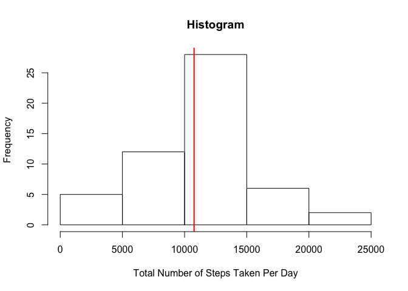
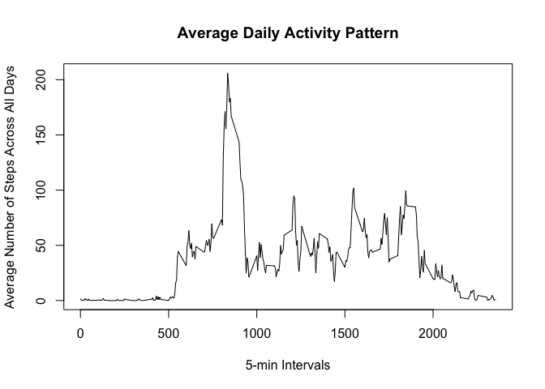
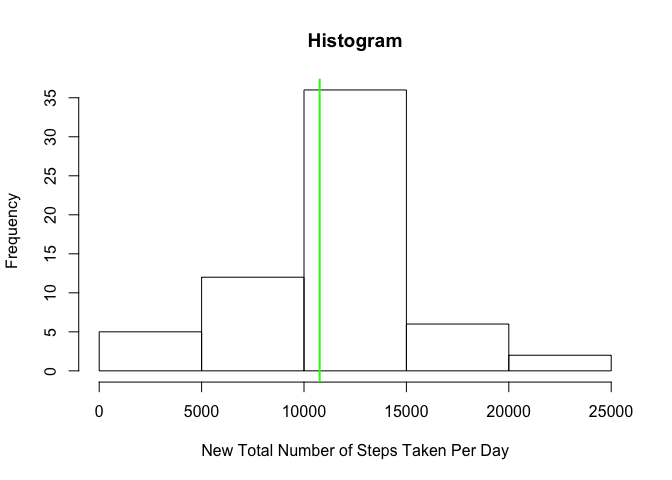
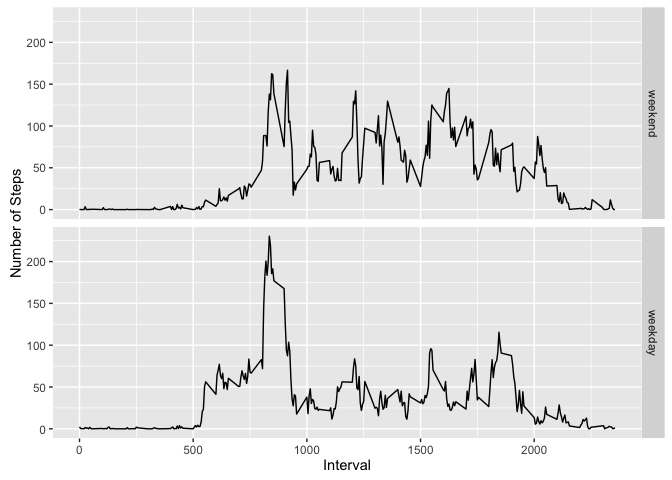

# Reproducible Research: Peer Assessment 1
Steve Chiu  
12 April 2016  


## Loading and preprocessing the data

The zip file "activity.zip", loaded in the working directory, was unzipped and read into *activity*.  An *actclean* dataset was also created to ignore the *NA* cases:


```r
unzip("activity.zip")
activity <- read.csv("activity.csv", header = TRUE)
head(activity)
```

```
##   steps       date interval
## 1    NA 2012-10-01        0
## 2    NA 2012-10-01        5
## 3    NA 2012-10-01       10
## 4    NA 2012-10-01       15
## 5    NA 2012-10-01       20
## 6    NA 2012-10-01       25
```

```r
str(activity)
```

```
## 'data.frame':	17568 obs. of  3 variables:
##  $ steps   : int  NA NA NA NA NA NA NA NA NA NA ...
##  $ date    : Factor w/ 61 levels "2012-10-01","2012-10-02",..: 1 1 1 1 1 1 1 1 1 1 ...
##  $ interval: int  0 5 10 15 20 25 30 35 40 45 ...
```

```r
actclean <- activity[complete.cases(activity),]
head(actclean)
```

```
##     steps       date interval
## 289     0 2012-10-02        0
## 290     0 2012-10-02        5
## 291     0 2012-10-02       10
## 292     0 2012-10-02       15
## 293     0 2012-10-02       20
## 294     0 2012-10-02       25
```

## What is mean total number of steps taken per day?

From *actclean* we generate the total number of steps taken per day into *daysteps*, followed by cleaning up those dates with no record, by calling the *camplete.cases* function:


```r
daysteps <- with(actclean, tapply(steps,date,sum))
daysteps <- daysteps[complete.cases(daysteps)]
head(daysteps)
```

```
## 2012-10-02 2012-10-03 2012-10-04 2012-10-05 2012-10-06 2012-10-07 
##        126      11352      12116      13294      15420      11015
```

Then we calculate the mean of the daily total steps from *daysteps*:


```r
print("Mean = ")
```

```
## [1] "Mean = "
```

```r
mean(daysteps)
```

```
## [1] 10766.19
```

A histogram was saved as *plot1.png*, with the mean marked in red line.


```r
hist(daysteps, xlab = "Total Number of Steps Taken Per Day", main = "Histogram")
abline(v=mean(daysteps), col = "red", lwd = 2)
```



```r
print("Medium = ")
```

```
## [1] "Medium = "
```

```r
median(daysteps)
```

```
## [1] 10765
```

## What is the average daily activity pattern?

First we generate the total number of steps taken per interval into *timesteps*.  A line chart was created in *plot2.png*.


```r
timesteps <- with(actclean, tapply(steps, interval, mean))
# Transformed into a dataframe for the time series plotting
meansteps <- data.frame(as.numeric(names(timesteps)), timesteps)
names(meansteps) = c("interval", "steps")

plot(meansteps, type="l", xlab="5-min Intervals", ylab="Average Number of Steps Across All Days", main="Average Daily Activity Pattern")
```



The maximum of steps can be provided by the *max* and *which.max* functions:


```r
max(meansteps$steps)
```

```
## [1] 206.1698
```

```r
which.max(meansteps$steps)
```

```
## 835 
## 104
```

The average daily activity reaches the maximum of 37.94 at the 104th time interval, which starts at 835 min.

## Imputing missing values

Going back to the original dataset *activity*, number of records with NA is:


```r
sum(is.na(activity$steps))
```

```
## [1] 2304
```

To fill up the missing values, we use the average number of steps (per each time interval) across all the dates, as shown in the *steps* column of the new dataset *actnew* below:


```r
library(dplyr)
```

```
## 
## Attaching package: 'dplyr'
```

```
## The following objects are masked from 'package:stats':
## 
##     filter, lag
```

```
## The following objects are masked from 'package:base':
## 
##     intersect, setdiff, setequal, union
```

```r
activity %>%
      arrange(interval, date) %>%
      group_by(interval) %>%
      mutate(activity$steps <- ifelse(is.na(steps), mean(steps, na.rm=TRUE), steps)) -> actnew
actnew <- arrange(as.data.frame(actnew[,2:4]), date, interval)
names(actnew)[3] <- "steps"
head(actnew)
```

```
##         date interval     steps
## 1 2012-10-01        0 1.7169811
## 2 2012-10-01        5 0.3396226
## 3 2012-10-01       10 0.1320755
## 4 2012-10-01       15 0.1509434
## 5 2012-10-01       20 0.0754717
## 6 2012-10-01       25 2.0943396
```

We apply the calculation of the total number of steps taken per day into *daystepsnew*:


```r
daystepsnew <- with(actnew, tapply(steps,date,sum))
head(daystepsnew)
```

```
## 2012-10-01 2012-10-02 2012-10-03 2012-10-04 2012-10-05 2012-10-06 
##   10766.19     126.00   11352.00   12116.00   13294.00   15420.00
```

Then we calculate the mean of the daily total steps from *daystepsnew*:


```r
print("Mean = ")
```

```
## [1] "Mean = "
```

```r
mean(daystepsnew)
```

```
## [1] 10766.19
```

A histogram was created in *plot3.png*, with the mean marked as green line.


```r
hist(daystepsnew, xlab = "New Total Number of Steps Taken Per Day", main = "Histogram")
abline(v=mean(daystepsnew), col = "green", lwd = 2)
```



```r
print("Medium = ")
```

```
## [1] "Medium = "
```

```r
median(daystepsnew)
```

```
## [1] 10766.19
```

It seems that, after filling in the missing values, the mean and medium are very close (or identitical) to the original ones, and the overall impact is minimal.

## Are there differences in activity patterns between weekdays and weekends?

We create two new columnes, namely *wd* and *wde* to show the day of the week and weekday/weekend respectively:


```r
wd <- weekdays(as.Date(actnew$date, "%Y-%m-%d"))
actnew <- cbind(actnew, wd)
actnew$wde <- sapply(actnew$wd, FUN = function(x) {if (x=="Saturday"| x=="Sunday") x <- "weekend" else x <- "weekday"})
actnew$wde <- as.factor(actnew$wde)
```

Two line charts are drawn below to compare the daily activity pattern between weekdays and weekends (saved as plot4.png).


```r
library(ggplot2)
actwd <- subset(actnew, wde=="weekday")
actwe <- subset(actnew, wde=="weekend")
timestepswd <- with(actwd, tapply(steps, interval, mean))
timestepswe <- with(actwe, tapply(steps, interval, mean))
meanstepswd <- data.frame(as.numeric(names(timestepswd)), timestepswd)
meanstepswe <- data.frame(as.numeric(names(timestepswe)), timestepswe)
names(meanstepswd) = c("interval", "steps")
names(meanstepswe) = c("interval", "steps")
meanstepswd <- cbind(meanstepswd, wde="weekday")
meanstepswe <- cbind(meanstepswe, wde="weekend")
meanstepswde <- rbind(meanstepswe, meanstepswd)

g <- ggplot(meanstepswde, aes(interval, steps))
g + geom_line() + facet_grid(wde ~ .) + labs(x="Interval") + labs(y="Number of Steps")
```


